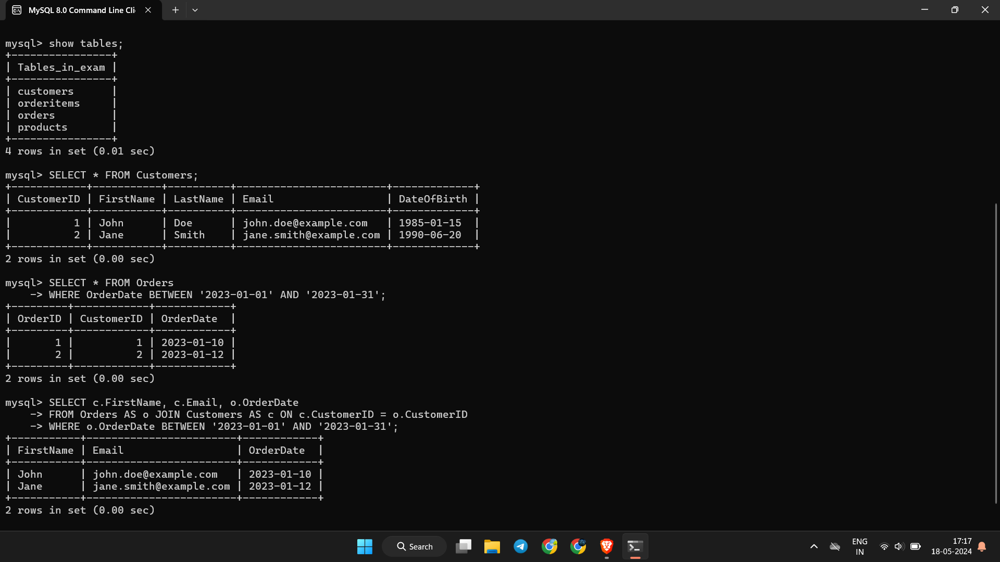

# Retail Store Database

This project contains the structure and sample data for a retail store database. The database includes tables for customers, products, orders, and order items. Additionally, a set of sample SQL queries is provided to demonstrate various operations on the database.

## Table of Contents
- [Database Structure](#database-structure)
- [Sample Data](#sample-data)
- [SQL Queries](#sql-queries)
- [Setup Instructions](#setup-instructions)

## Database Structure

The database consists of the following tables:

1. **Customers**
   - `CustomerID`: INT, PRIMARY KEY
   - `FirstName`: VARCHAR(50)
   - `LastName`: VARCHAR(50)
   - `Email`: VARCHAR(100)
   - `DateOfBirth`: DATE

2. **Products**
   - `ProductID`: INT, PRIMARY KEY
   - `ProductName`: VARCHAR(100)
   - `Price`: DECIMAL(10, 2)

3. **Orders**
   - `OrderID`: INT, PRIMARY KEY
   - `CustomerID`: INT, FOREIGN KEY references `Customers(CustomerID)`
   - `OrderDate`: DATE

4. **OrderItems**
   - `OrderItemID`: INT, PRIMARY KEY
   - `OrderID`: INT, FOREIGN KEY references `Orders(OrderID)`
   - `ProductID`: INT, FOREIGN KEY references `Products(ProductID)`
   - `Quantity`: INT

## Sample Data

### Customers
| CustomerID | FirstName | LastName | Email                | DateOfBirth |
|------------|-----------|----------|----------------------|-------------|
| 1          | John      | Doe      | john.doe@example.com | 1985-01-15  |
| 2          | Jane      | Smith    | jane.smith@example.com| 1990-06-20  |

### Products
| ProductID | ProductName | Price |
|-----------|--------------|-------|
| 1         | Laptop       | 1000  |
| 2         | Smartphone   | 600   |
| 3         | Headphones   | 100   |

### Orders
| OrderID | CustomerID | OrderDate  |
|---------|------------|------------|
| 1       | 1          | 2023-01-10 |
| 2       | 2          | 2023-01-12 |

### OrderItems
| OrderItemID | OrderID | ProductID | Quantity |
|-------------|---------|-----------|----------|
| 1           | 1       | 1         | 1        |
| 2           | 1       | 3         | 2        |
| 3           | 2       | 2         | 1        |
| 4           | 2       | 3         | 1        |

## SQL Queries

### 1. List all customers

