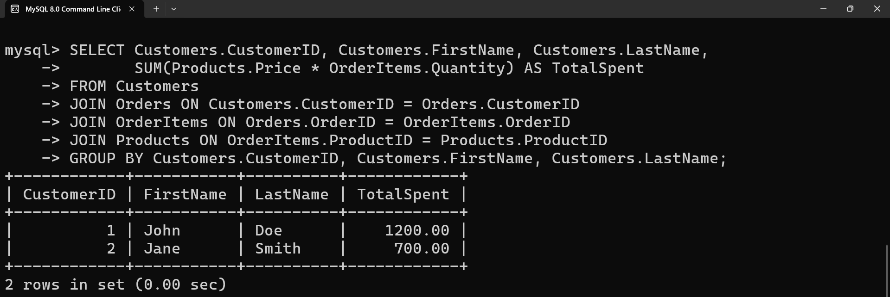

# Retail Store Database

This project contains the structure and sample data for a retail store database. The database includes tables for customers, products, orders, and order items. Additionally, a set of sample SQL queries is provided to demonstrate various operations on the database.

## Outputs:

###  1. List all customers 

### 2. Find all orders placed in January 2023

### 3. Get the details of each order, including the customer name and email

### 4. List the products purchased in a specific order (e.g., OrderID = 1)

### 5. Calculate the total amount spent by each customer

### 6. Find the most popular product (the one that has been ordered the most)

### 7. Get the total number of orders and the total sales amount for each month in 2023

### 8. Find customers who have spent more than $1000

